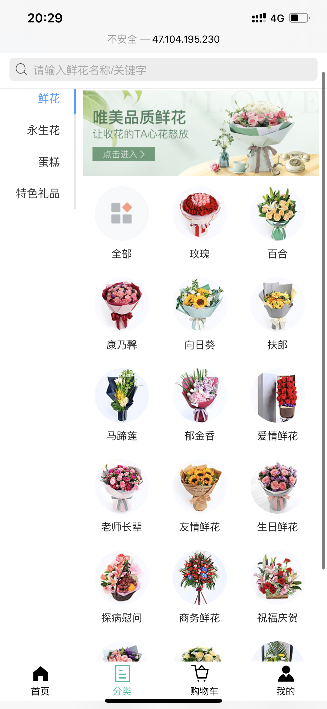
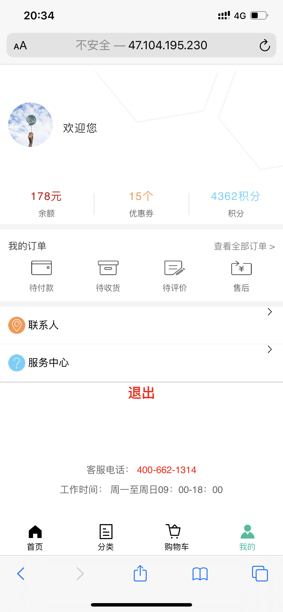

#   vue团队项目说明
### 项目名称：斗南花立购

### 演示
-   项目上线地址
    -   WebApp地址
        -   http://47.104.195.230:8826

### git仓库地址
-   项目在github上的仓库地址
    - https://github.com/gzh51907/Florist.git

### 团队与分工
-   团队成员
    -   组长：刘健
    -   组员：王昕
-   负责模块说明
    -   刘健负责的模块
        -   项目搭建，项目分配，合并解决冲突，首页，分类页面，列表页面，后端接口验证
    -   王昕负责的模块
        -   详情页面，购物车，我的页面，登录注册，后台管理系统UI

### 项目页面截图

#### 1 首页 ↓↓↓


#### 2 分类页 ↓↓↓


#### 3 列表页 ↓↓↓


#### 4 详情页 ↓↓↓


#### 5 购物车 ↓↓↓


#### 6 我的页面 ↓↓↓


### 项目目录说明
- src为webapp的源码
    - assets为静态图片资源
    - pages为各个路由页面
    - router为管理所有路由的总文件
- node-server为后端接口相关内容
    - src源码
        - db为mongoDB做增删查改函数的封装
        - router为商品操作、用户操作等相关接口
        - utils为数据相关工具
- florist-bms为后台管理系统
    - src为后台管理系统的源码
        - assets为静态图片资源
        - pages为各个路由页面
        - router为管理所有路由的总文件

#### 项目目录结构
```
│  .gitignore
│  babel.config.js
│  package-lock.json
│  package.json
│  README.md
│  vue.config.js
│  
├─florist-bms
│  │  .gitignore
│  │  babel.config.js
│  │  package-lock.json
│  │  package.json
│  │  README.md
│  │  vue.config.js
│  │  
│  ├─public
│  │      favicon.ico
│  │      index.html
│  │      
│  └─src
│      │  App.vue
│      │  main.js
│      │  
│      ├─assets
│      │      logo.png
│      │      
│      ├─components
│      │      HelloWorld.vue
│      │      
│      ├─pages
│      │      adduser.vue
│      │      goodlist.vue
│      │      order.vue
│      │      userlist.vue
│      │      
│      └─router
│              index.js
│              
├─node-serve
│  │  .gitignore
│  │  package-lock.json
│  │  package.json
│  │  
│  └─src
│      │  config.json
│      │  index.html
│      │  server.js
│      │  
│      ├─db
│      │      index.js
│      │      mongo.js
│      │      
│      ├─routers
│      │      carts.js
│      │      goods.js
│      │      index.js
│      │      user.js
│      │      
│      └─utils
│              index.js
│              token.js
│              
├─public
│      favicon.ico
│      index.html
│      
└─src
    │  App.vue
    │  main.js
    │  rem.js
    │  
    ├─components
    │      HelloWorld.vue
    │      
    ├─pages
    │      Cart.vue
    │      Classify.vue
    │      Detail.vue
    │      Home.vue
    │      List.vue
    │      Login.vue
    │      Mine.vue
    │      Reg.vue
    │      
    └─router
            index.js
```


# florist

## Project setup
```
npm install
```

### Compiles and hot-reloads for development
```
npm run serve
```

### Compiles and minifies for production
```
npm run build
```

### Run your tests
```
npm run test
```

### Lints and fixes files
```
npm run lint
```

### Customize configuration
See [Configuration Reference](https://cli.vuejs.org/config/).
